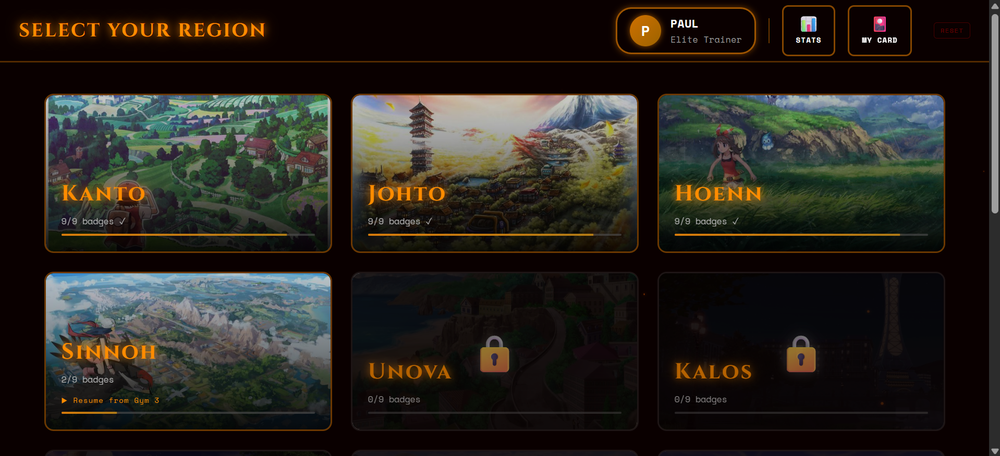
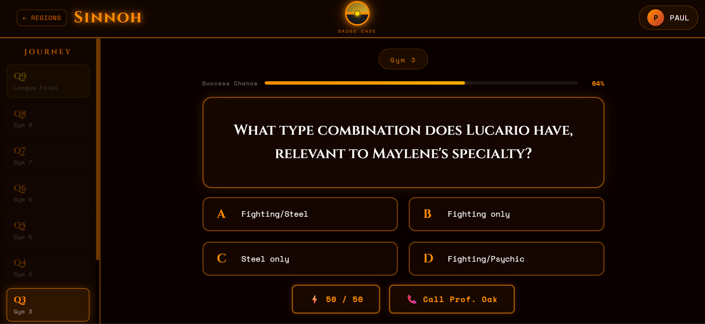
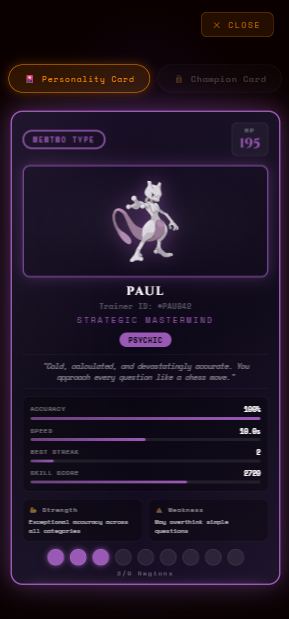
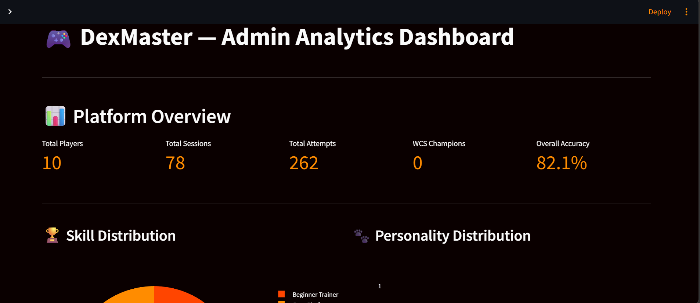

#  DexMaster

A Pokémon-themed adaptive quiz platform combining KBC-style trivia mechanics with real machine learning — built as a full-stack data science portfolio project.

**🎮 Play it live:** https://dexmaster-pi.vercel.app

---

##  Overview

DexMaster is a 9-region trivia game where players battle through Gym Leaders, earn badges, and compete in a World Coronation Series finale — all while their gameplay behavior is analyzed in real time using machine learning.

This isn't just a quiz app with a Pokémon skin. Every player interaction — accuracy, response time, lifeline usage, category performance — is logged to a database and used to:

- **Classify player personality** into 8 Pokémon archetypes (Mewtwo, Charizard, Snorlax, Pikachu, Psyduck, Piplup, Gengar, Eevee) using **K-Means clustering**
- **Predict question success probability** using a trained **Random Forest Classifier**
- **Recommend adaptive question difficulty** based on real-time performance
- Power an **admin analytics dashboard** for cross-player insights

---

##  Tech Stack

**Frontend**
- React + Vite
- Recharts (data visualization)
- Framer Motion (animations)

**Backend**
- FastAPI (Python)
- MySQL + SQLAlchemy ORM
- Pandas + Scikit-learn

**Machine Learning**
- K-Means Clustering (unsupervised personality classification)
- Random Forest Classifier (supervised difficulty prediction)

**Analytics**
- Streamlit + Plotly (admin dashboard)

**Deployment**
- Vercel (frontend)
- Railway (backend + MySQL)
- Streamlit Community Cloud (dashboard)

---

##  Machine Learning Approach

### K-Means Personality Clustering
Rather than hardcoding which behavior maps to which personality, K-Means clusters players based on four features:
- Accuracy
- Average response time
- Lifeline usage rate
- Category performance variance (consistency)

The model independently discovers behavioral groups; each cluster's centroid is then mapped to the closest matching personality archetype.

### Random Forest Difficulty Predictor
Trained on real gameplay attempts (player accuracy, streak, response time, question difficulty) to predict probability of a correct answer.

**Current status:** Offline-validated, not yet in production inference path. Trained on 162 real attempts — ROC-AUC of 0.612, showing a genuine learned signal above random chance. The frontend currently uses a rule-based formula for the live difficulty bar; this is an intentional scope decision given the small training sample, not a technical limitation. A clear next step would be collecting more gameplay data and properly computing rolling per-attempt features (currently using simplified placeholders for accuracy-so-far and streak during training).

---

##  Screenshots

| Intro | Region Select | Quiz |
|---|---|---|
|  |  |  |

| Personality Card | Champion Screen | Admin Dashboard |
|---|---|---|
|  |  |  |

---

##  Features

- 9 regions × 8 gyms × adaptive question pools (486+ questions)
- World Coronation Series — timed master-level finale, no lifelines
- Device-based player identity (no login required)
- Resume system — pick up exactly where you left off, lifelines and all
- Animated Professor Oak lifeline with randomized dialogue
- Holographic personality & champion trading cards
- Full mobile responsiveness
- Real-time difficulty prediction bar
- Admin analytics dashboard with leaderboards, category breakdowns, and live clustering

---

##  Architecture


---

##  Running Locally

**Frontend:**
```bash
cd dexmaster
npm install
npm run dev
```

**Backend:**
```bash
cd dexmaster-backend
pip install -r requirements.txt
uvicorn main:app --reload
```

**Dashboard:**
```bash
cd dexmaster-backend
streamlit run admin/dashboard.py
```

You'll need a local MySQL instance and a `.env` file in `dexmaster-backend/` with your database credentials (see `.env.example`).

---

##  Known Limitations

- Random Forest model trained on a small sample (162 attempts) — results are directionally meaningful but not statistically robust
- Device-based identity means progress doesn't sync across different devices for the same player
- Random Forest predictions are validated offline but not yet wired into the live difficulty bar

---

##  License

This is a fan-made, non-commercial project built for educational and portfolio purposes. Not affiliated with Nintendo, Game Freak, or The Pokémon Company. All Pokémon names and references belong to their respective owners.

---

##  Author

Built by [Namrata Singh] — [www.linkedin.com/in/namrata-singh-3658b0287] 
